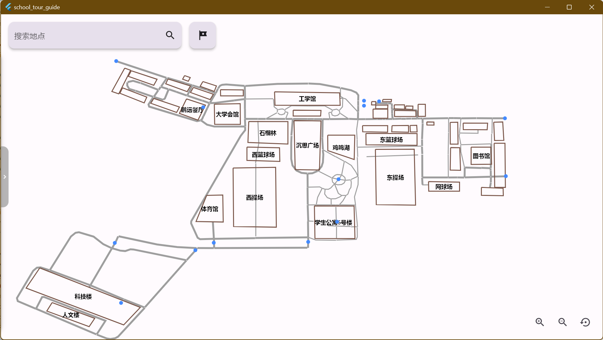
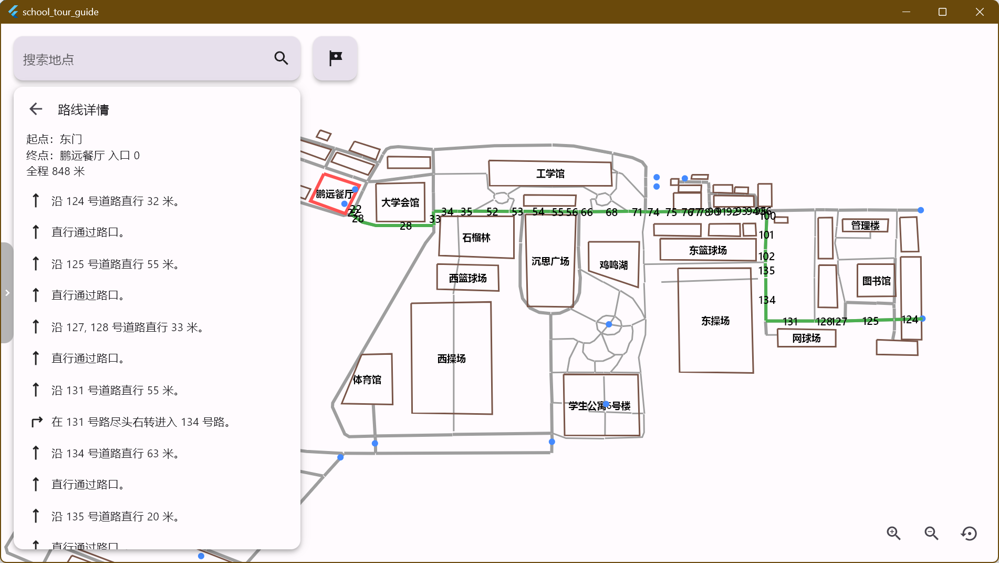
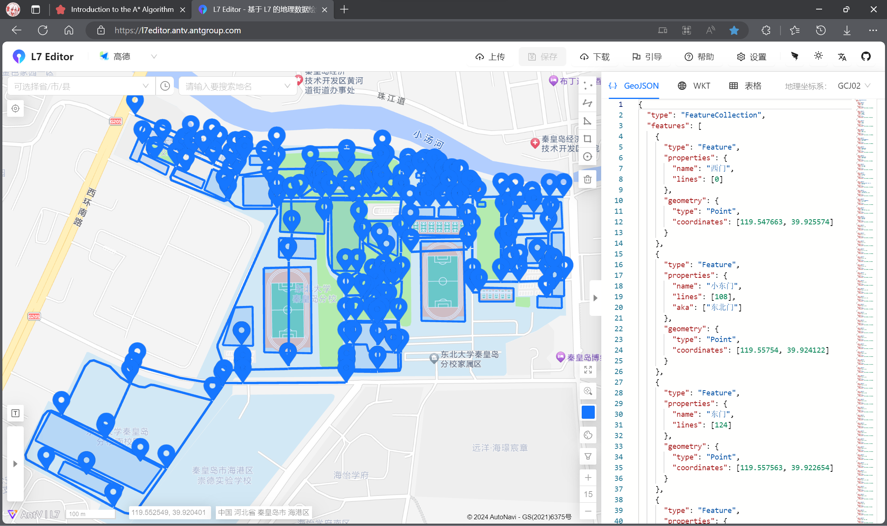
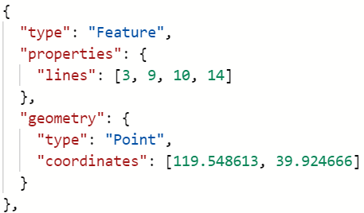
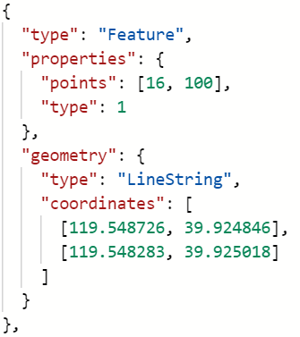

# school_tour_guide

### 软件介绍

- 地图数据包含171个点位、221条折线、44个多边形。
- 鼠标滚轮/按钮控制地图缩放、右键地图选点、地点检索、路径规划（单点/多点）、*路径描述（验收后新添的功能）*

### 课设题目要求

- [x] 设计你所在学校的校园平面图,所含景点不少于10个。以图中顶点表示校内各景点,存放景点名称、代号、简介等信息;以边表示路径,存放路径长度等相关信息。
- [x] 提供图中任意景点相关信息的查询。
- [x] 查询任意两个景点之间的一条最短的简单路径。 
- [ ] 求任意两个景点之间的所有路径。***可行性存疑***
- [x] 求途经这多个景点的最佳 ( 短 )路径。_逃课：对相邻两个点进行A-Star Serching_
- [x] 扩充道路信息 , 如道路类别 ( 车道、人行道等 ) 、沿途景色等级 , 以至可按客人所需分别查询人行路径或车行路径或观景路径等。
- [x] 扩充每个景点的邻接景点的方向等信息 , 使得路径查询结果能提供详尽的导向信息。实现提示：一般情况下,校园的道路是双向通行的,可设校园平面图是一个无向网。顶点和边均 含有相关信息。

### 地图数据准备

原数据见 [all_features.json](raw_map_data/all_features.json)

1. 在道路交叉处、建筑物出入口、地点标点，以标点先后为ID序
2. 沿着道路在两点之间划折线，以划线先后为ID序
3. 标注每个点连接的道路和每条道路连接的点，用ID表示   
   
   
4. 沿着建筑物画多边形，以先后为ID序。用ID标注包含的出入口
5. 根据实际情况添加 `name`, `aka`, `contains` 等字段

### 验收过程

1. **老师**：（你这个地图）有多少个景点？   
   **我**：大概二三十个吧，但总的点位有一百七十多个。（实际上只有十个景点，不过确实是有 171 个点位。）
2. **老师**：用的是什么寻路算法？   
   **我**：A\*算法。   
   **老师**：为什么用A\*算法呢？   
   **我**：A\*算法是基于dijkstra算法（当时甚至记不起来这个名称）的。dijkstra算法在寻找下一个要遍历的点时，选取距离起点最近的点。A\*算法则是选择离起点和离终点的距离最近的点。所以A\*算法在选取下一个遍历点时会比dijkstra算法更直接地指向终点，遍历的次数更少。   
   **老师**：所以A\*算法走的每一步都是最小的？   
   **我**：大概吧。（好像不是这样，但当时想当然地直接这样回答了。）
3. **老师**：先打开软件看看吧。   
   **老师**：哇，这是我们学校？从哪里获取的地图数据呢？   
   **我**：是的。地图数据在一个网站上（打开网站 [L7 Editer 地理数据绘制工具](https://l7editor.antv.antgroup.com/)）画点描线弄出来的。底图是高德地图。   
   **老师**：工作量挺大啊。那这样我们从东门到鹏远餐厅吧。   
   **我**：好的。我们可以右键单击鹏远餐厅来直接选择它，然后输入东门作为起点，点击驾驶导航或者步行导航。（软件用绿色线条显示规划路径的同时在底部短暂弹窗显示距离，但当时还没有做路径描述。）   
   **老师**：不可以看总的距离吗？   
   **我**：可以的，刚刚在底部弹出的就是（再次演示一遍）。   
   **老师**：噢这样。这个（地图）弄得不错。
4. **老师**：这个软件使用什么做的？   
   然后就开始谈Flutter和Dart。老师说他没有听说过这个，然后问了框架提出者、它有什么优势、它用什么语言等等。这之后验收就结束了。   

总结：虽然老师问的都答上来了，但是完全没有问到具体的实现，有点不尽兴。

### 更新

2023/12/18 ~ 2024/01/03   
见 [题目要求](#课设题目要求)

2024/01/08: 
- 显示规划路线道路标号
- 求两条不同道路之间的夹角
- 生成路径描述
- 合并直行路段

2024/01/09: 
- 路径描述页面
- 路径描述左边显示表示方向的Icon
- 只在交叉路口进行方向判断
